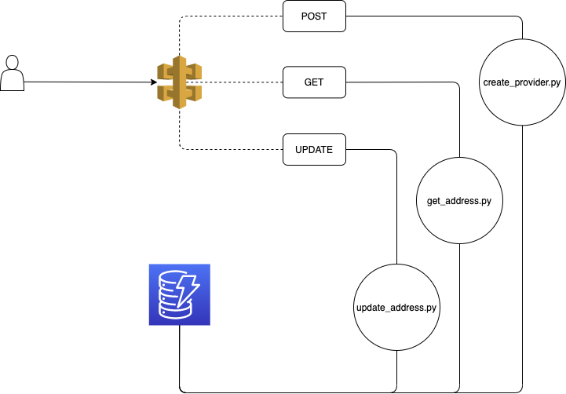

# CIPAM
Cloud IP Address Management is a tool to run native in AWS, serverless to manage internal IP address in multiple accounts without overlapping.

## Architecture

In actual version support 3 methods: POST, GET and UPDATE. 

Each method has specific action with IPAM requirements. 

